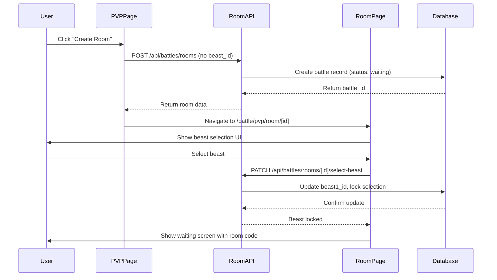

# Design Document

## Overview

This design restructures the PVP battle flow to improve user experience by prioritizing room commitment before beast selection. The new flow eliminates the friction of selecting a beast before knowing the battle context, aligns with standard multiplayer game patterns, and prevents mid-battle beast changes through a locking mechanism.

**Current Flow:**
1. Navigate to /battle/pvp
2. Select a beast from the list
3. Choose action (Create Room / Browse Rooms / Join by Code)
4. Enter room and wait/battle

**New Flow:**
1. Navigate to /battle/pvp
2. Choose action (Create Room / Browse Rooms / Join by Code)
3. Enter room page
4. Select beast (locked once confirmed)
5. Wait for opponent or battle starts

## Architecture

### Component Structure

```
/battle/pvp (Main PVP Page)
├── Room Action Buttons
│   ├── Create Room Button
│   ├── Browse Rooms Button
│   └── Join by Code Button
└── No Beast Selection UI

/battle/pvp/room/[id] (Room Page)
├── Beast Selection Interface (if not selected)
├── Waiting Screen (after selection, before opponent)
├── Battle Arena (when both players ready)
└── Room Management (cancel, share code)

/battle/pvp/rooms (Browse Rooms Page)
├── Available Rooms List
├── Room Cards with Host Beast Info
└── Join Room Actions
```

### State Management

The application manages several key states:

1. **Room State**: waiting → in_progress → completed
2. **Beast Selection State**: null → selected → locked
3. **Player State**: no_room → in_room_no_beast → in_room_beast_selected → battling

### Data Flow



## Components and Interfaces

### Frontend Components

#### 1. PVPBattlePage (/battle/pvp/page.tsx)

**Purpose**: Main entry point for PVP battles, displays room action options

**State**:
- `userId`: Current user ID
- `myBeasts`: User's available beasts (for validation only)
- `error`: Error messages

**Key Changes**:
- Remove beast selection UI completely
- Display only three action buttons prominently
- Check if user has beasts (show warning if none)
- No `selectedBeast` state needed

**UI Elements**:
- Create Room button (primary action)
- Browse Rooms button
- Join by Code button
- Warning message if no beasts available

#### 2. PVPRoomPage (/battle/pvp/room/[id]/page.tsx)

**Purpose**: Handles beast selection, waiting, and battle within a specific room

**State**:
- `battle`: Current battle data
- `myBeast`: Selected beast (null until selected)
- `opponentBeast`: Opponent's beast
- `beastSelectionLocked`: Boolean indicating if selection is locked
- `isHost`: Whether current user is room creator
- `availableBeasts`: User's beasts for selection

**Views**:
1. **Beast Selection View** (when myBeast is null)
   - Display user's available beasts
   - Show opponent's beast if already selected
   - Confirm selection button
   
2. **Waiting View** (after beast selected, before opponent)
   - Display room code prominently
   - Show selected beast
   - Share options (copy code, Telegram)
   - Cancel room button
   
3. **Battle View** (when both beasts selected)
   - Existing battle UI
   - Both beasts locked and displayed

#### 3. RoomsListPage (/battle/pvp/rooms/page.tsx)

**Purpose**: Browse available rooms

**Key Changes**:
- Remove beast selection requirement
- Allow browsing without pre-selecting beast
- Navigate directly to room page on join

### Backend API Endpoints

#### 1. POST /api/battles/rooms

**Current Behavior**: Requires `beast_id` in request body

**New Behavior**: Create room without beast selection

**Request**:
```typescript
{
  player_id: string
  // beast_id removed
}
```

**Response**:
```typescript
{
  battle: {
    id: string
    room_code: string
    player1_id: string
    beast1_id: null  // Not selected yet
    status: 'waiting'
    created_at: string
  }
}
```

#### 2. PATCH /api/battles/rooms/[id]/select-beast (NEW)

**Purpose**: Select and lock a beast for a battle room

**Request**:
```typescript
{
  player_id: string
  beast_id: number
}
```

**Validation**:
- Battle must exist
- Player must be part of the battle (player1 or player2)
- Beast must belong to the player
- Beast selection must not already be locked for this player
- Battle status must be 'waiting' or 'in_progress' (not 'completed')

**Response**:
```typescript
{
  success: true
  battle: {
    id: string
    player1_id: string
    player2_id: string | null
    beast1_id: number | null
    beast2_id: number | null
    beast1_locked: boolean
    beast2_locked: boolean
    status: string
    current_turn: string | null
  }
}
```

**Side Effects**:
- Set beast1_id or beast2_id based on player
- Set beast1_locked or beast2_locked to true
- If both beasts selected and locked, update status to 'in_progress' and set current_turn

#### 3. POST /api/battles/rooms/join

**Current Behavior**: Requires `beast_id` in request body

**New Behavior**: Join room without beast selection

**Request**:
```typescript
{
  room_code: string
  player_id: string
  // beast_id removed
}
```

**Response**:
```typescript
{
  success: true
  battle_id: string
  battle: {
    id: string
    player1_id: string
    player2_id: string
    beast1_id: number | null
    beast2_id: null  // Not selected yet
    status: 'waiting'  // Remains waiting until both beasts selected
  }
}
```

**Changes**:
- Set player2_id but leave beast2_id as null
- Keep status as 'waiting' (not 'in_progress')
- Don't set current_turn yet

## Data Models

### Database Schema Changes

#### battles table

**New Columns**:
```sql
ALTER TABLE battles 
  ADD COLUMN IF NOT EXISTS beast1_locked BOOLEAN DEFAULT FALSE,
  ADD COLUMN IF NOT EXISTS beast2_locked BOOLEAN DEFAULT FALSE;
```

**Column Descriptions**:
- `beast1_locked`: Indicates if player1's beast selection is locked
- `beast2_locked`: Indicates if player2's beast selection is locked

**State Transitions**:
```
Initial: beast1_id=null, beast2_id=null, beast1_locked=false, beast2_locked=false, status='waiting'
Player1 selects: beast1_id=X, beast1_locked=true, status='waiting'
Player2 joins: player2_id=Y, status='waiting'
Player2 selects: beast2_id=Z, beast2_locked=true, status='in_progress', current_turn=faster_beast_owner
```

### TypeScript Interfaces

```typescript
interface Battle {
  id: string
  player1_id: string
  player2_id: string | null
  beast1_id: number | null
  beast2_id: number | null
  beast1_locked: boolean
  beast2_locked: boolean
  current_turn: string | null
  status: 'waiting' | 'in_progress' | 'completed'
  winner_id: string | null
  room_code: string
  battle_type: 'pvp' | 'pve'
  created_at: string
  updated_at: string
}

interface BeastSelectionRequest {
  player_id: string
  beast_id: number
}

interface RoomCreationRequest {
  player_id: string
  // No beast_id
}

interface RoomJoinRequest {
  room_code: string
  player_id: string
  // No beast_id
}
```


## Correctness Properties

*A property is a characteristic or behavior that should hold true across all valid executions of a system-essentially, a formal statement about what the system should do. Properties serve as the bridge between human-readable specifications and machine-verifiable correctness guarantees.*

### Property 1: Room creation without beast requirement

*For any* valid player ID, creating a battle room should succeed without providing a beast_id, and the created room should have null beast selections and 'waiting' status.
**Validates: Requirements 1.2, 1.5, 9.1**

### Property 2: Beast selection updates database

*For any* player in a battle room and any beast owned by that player, selecting the beast should update the corresponding beast_id field (beast1_id or beast2_id) and set the locked flag to true.
**Validates: Requirements 2.4, 3.1, 9.2**

### Property 3: Beast lock prevents changes

*For any* battle where a player's beast is locked, attempts to change that player's beast selection should fail with an appropriate error.
**Validates: Requirements 3.2, 9.5**

### Property 4: Both beasts locked triggers battle start

*For any* battle where both beast1_locked and beast2_locked are true, the battle status should be 'in_progress' and current_turn should be set to the player with the faster beast.
**Validates: Requirements 3.3, 4.4, 9.3**

### Property 5: Beast lock persists across states

*For any* battle in 'in_progress' or 'completed' status, both beast1_locked and beast2_locked should remain true.
**Validates: Requirements 3.4**

### Property 6: Room cancellation in waiting state

*For any* battle room with status 'waiting', the room creator should be able to successfully cancel (delete) the room.
**Validates: Requirements 4.5**

### Property 7: Beast information rendering completeness

*For any* beast displayed in the UI (host's beast or room list), the rendered output should contain the beast's name, level, type, and stats (attack, defense, HP).
**Validates: Requirements 5.3, 7.2**

### Property 8: Battle start on second beast selection

*For any* battle where player1 has locked their beast and player2 selects their beast, the battle status should immediately transition to 'in_progress'.
**Validates: Requirements 5.4**

### Property 9: Self-join prevention

*For any* player attempting to join a room, if the room's player1_id matches the joining player's ID, the join operation should fail with an appropriate error.
**Validates: Requirements 7.5**

### Property 10: Valid room code navigation

*For any* valid 6-character room code corresponding to an existing 'waiting' battle, entering the code should successfully navigate to that room's page.
**Validates: Requirements 8.2**

### Property 11: Invalid room code error handling

*For any* invalid room code (non-existent, wrong format, or non-waiting status), the join attempt should fail with a descriptive error message.
**Validates: Requirements 8.3**

### Property 12: Case-insensitive room codes

*For any* valid room code, entering it in uppercase, lowercase, or mixed case should all successfully resolve to the same room.
**Validates: Requirements 8.5**

### Property 13: Beast ownership validation

*For any* beast selection attempt, if the beast_id does not belong to the player making the selection, the operation should fail with an authorization error.
**Validates: Requirements 9.4**

## Error Handling

### Client-Side Validation

1. **Beast Availability Check**
   - Before allowing room actions, verify user has at least one beast
   - Display friendly message directing to inventory if no beasts

2. **Room Code Format**
   - Validate 6-character alphanumeric format before API call
   - Provide immediate feedback on invalid format

3. **Network Errors**
   - Display retry options for failed API calls
   - Show connection status indicators
   - Implement automatic reconnection for real-time subscriptions

### Server-Side Validation

1. **Beast Selection Validation**
   ```typescript
   // Validate beast ownership
   if (beast.owner_address !== player.wallet_address) {
     return error(403, 'Beast does not belong to player')
   }
   
   // Validate beast not already locked
   if (isPlayer1 && battle.beast1_locked) {
     return error(400, 'Beast selection already locked')
   }
   ```

2. **Room State Validation**
   ```typescript
   // Validate room is in correct state for operation
   if (operation === 'select_beast' && battle.status === 'completed') {
     return error(400, 'Cannot select beast for completed battle')
   }
   ```

3. **Concurrent Operation Handling**
   - Use database-level locking for critical operations
   - Implement optimistic locking with version checks
   - Handle race conditions gracefully with appropriate error messages

### Error Messages

- **User-Friendly**: "You need at least one beast to battle. Visit your inventory to get started!"
- **Specific**: "This room code doesn't exist. Please check and try again."
- **Actionable**: "This room has already started. Browse available rooms or create a new one."

## Testing Strategy

### Unit Testing

Unit tests will verify specific examples and edge cases:

1. **API Endpoint Tests**
   - Room creation without beast_id succeeds
   - Beast selection with valid data updates database
   - Beast selection with invalid beast_id fails
   - Room cancellation in waiting state succeeds
   - Room cancellation in in_progress state fails

2. **Component Tests**
   - PVP page renders action buttons
   - PVP page does not render beast selection
   - Room page renders beast selection when beast is null
   - Room page renders waiting screen when beast is selected
   - Room page shows locked indicator when beast is locked

3. **Validation Tests**
   - Room code format validation
   - Beast ownership validation
   - Locked beast change prevention
   - Self-join prevention

### Property-Based Testing

Property-based tests will verify universal properties across all inputs using **fast-check** (JavaScript/TypeScript property testing library):

1. **Room Creation Property**
   - Generate random player IDs
   - Create rooms without beast_id
   - Verify all rooms have null beasts and 'waiting' status

2. **Beast Selection Property**
   - Generate random valid player/beast combinations
   - Select beasts in rooms
   - Verify database updates and lock flags

3. **Beast Lock Immutability Property**
   - Generate random locked beast scenarios
   - Attempt to change locked beasts
   - Verify all attempts fail

4. **State Transition Property**
   - Generate random two-player scenarios
   - Lock both beasts
   - Verify status transitions to 'in_progress'

5. **Room Code Case Insensitivity Property**
   - Generate random valid room codes
   - Test with uppercase, lowercase, mixed case
   - Verify all resolve to same room

**Configuration**: Each property-based test will run a minimum of 100 iterations to ensure thorough coverage of the input space.

**Test Tagging**: Each property-based test will include a comment tag in the format:
```typescript
// Feature: pvp-battle-flow-improvements, Property 1: Room creation without beast requirement
```

### Integration Testing

1. **Complete Flow Tests**
   - Create room → Select beast → Wait → Opponent joins → Opponent selects → Battle starts
   - Browse rooms → Join room → Select beast → Battle starts
   - Join by code → Select beast → Battle starts

2. **Real-Time Subscription Tests**
   - Verify room list updates when rooms created/filled
   - Verify opponent join notifications
   - Verify battle state updates propagate

3. **Concurrent Operation Tests**
   - Multiple players trying to join same room
   - Room cancellation while opponent joining
   - Beast selection race conditions

### Manual Testing Checklist

- [ ] Navigate to PVP page, verify no beast selection UI
- [ ] Create room without selecting beast
- [ ] Select beast in room, verify lock indicator
- [ ] Try to change locked beast, verify prevention
- [ ] Share room code via Telegram
- [ ] Join room from another account
- [ ] Verify battle starts when both beasts selected
- [ ] Test room cancellation
- [ ] Test browse rooms functionality
- [ ] Test join by code with valid/invalid codes
- [ ] Test with no beasts available
- [ ] Test case-insensitive room codes

## Implementation Notes

### Migration Strategy

1. **Database Migration**
   - Add beast1_locked and beast2_locked columns
   - Set default values to false
   - Update existing battles to have locked=true if beast_id is not null

2. **API Changes**
   - Create new endpoint: PATCH /api/battles/rooms/[id]/select-beast
   - Modify POST /api/battles/rooms to not require beast_id
   - Modify POST /api/battles/rooms/join to not require beast_id
   - Keep existing endpoints backward compatible during transition

3. **Frontend Changes**
   - Update PVP page to remove beast selection
   - Update room page to add beast selection UI
   - Update navigation flows
   - Update real-time subscription handlers

### Backward Compatibility

During the transition period:
- Old clients can still use the existing flow (beast selection before room creation)
- New clients use the new flow (beast selection after room creation)
- Both flows write to the same database schema
- Once all clients updated, remove old flow support

### Performance Considerations

1. **Database Queries**
   - Add index on (status, battle_type) for room listing
   - Use SELECT FOR UPDATE for beast selection to prevent race conditions

2. **Real-Time Updates**
   - Optimize subscription queries to only fetch necessary fields
   - Implement debouncing for rapid state changes

3. **Caching**
   - Cache user's beast list on room page
   - Cache room list with short TTL (2-3 seconds)

### Security Considerations

1. **Authorization**
   - Verify player owns beast before allowing selection
   - Verify player is part of battle before allowing operations
   - Prevent unauthorized room cancellation

2. **Input Validation**
   - Sanitize room codes
   - Validate beast IDs exist and are active
   - Prevent SQL injection in all queries

3. **Rate Limiting**
   - Limit room creation to prevent spam
   - Limit beast selection attempts to prevent abuse
