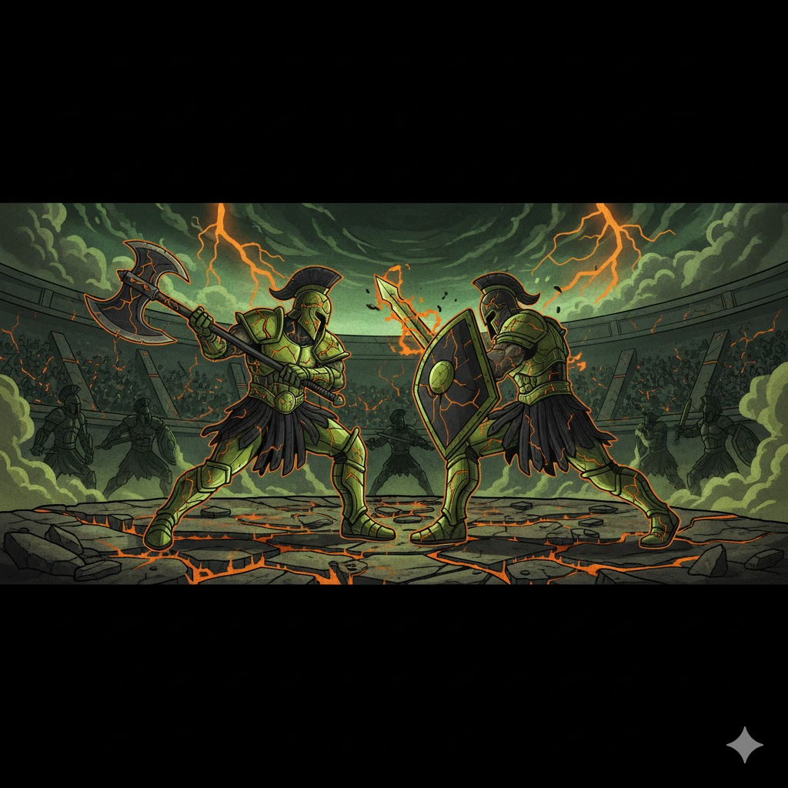

# ArenaRise ⚔️

> **Built for TON | The Open Hack Hackathon 2025** 🏆



**ArenaRise** is a retro-style, 8-bit PVP battle game built on the **TON blockchain**. Collect unique beasts, stake $RISE tokens, and battle opponents in real-time for glory and rewards!

---

## 🚀 The Open Hack 2025

Proudly built for **The Open Hack Hackathon 2025**.

ArenaRise leverages the speed and scalability of the **The Open Network (TON)** to deliver a seamless Web3 gaming experience directly inside Telegram or your browser.

---

## ✨ Key Features

- **⚡ Real-Time PVP Battles**: Challenge players worldwide in turn-based combat with instant move synchronization.
- **💎 Stake & Win**: Stake **$RISE** tokens on your battles. Winner takes all!
- **🦁 Beast Collection**: Own unique, upgradable beasts with distinct elemental types and stats.
- **📱 Telegram Mini App**: Fully optimized for a native experience within Telegram.
- **🔒 Secure & Non-Custodial**: Connect with your favorite TON wallet (Tonkeeper, etc.).

---

## 📸 Showcase

<div align="center">
  
  <p><em>User Profile & Beast Collection</em></p>
</div>

<div align="center">
  <div style="display: flex; justify-content: center; gap: 20px;">
    
    
  </div>
  <p><em>Token Swaps & Battle Results</em></p>
</div>

---

## �🛠️ Tech Stack

- **Frontend**: Next.js 16, React 19, Tailwind CSS
- **Blockchain**: TON Connect UI, @ton/core
- **Backend/DB**: Supabase (PostgreSQL + Realtime)
- **Styling**: Lucide React, Radix UI, Custom 8-bit Design

---

## 🎮 How to Play

1.  **Connect Wallet**: Link your TON wallet to create your profile.
2.  **Get a Beast**: Mint or select your starting beast.
3.  **Choose Mode**:
    *   **PVE**: Practice against AI opponents.
    *   **PVP**: Create or join a room to fight real players.
4.  **Battle**: Use strategy to defeat your opponent's beast before yours falls!

---

## 🚀 Getting Started

### Prerequisites

- Node.js & Yarn/NPM
- A Supabase project (see `SETUP_GUIDE.md`)

### Installation

1.  **Clone the repository**
    ```bash
    git clone https://github.com/yourusername/arenarise.git
    cd arenarise
    ```

2.  **Install dependencies**
    ```bash
    yarn install
    ```

3.  **Set up Environment Variables**
    Create a `.env.local` file:
    ```env
    NEXT_PUBLIC_SUPABASE_URL=your_supabase_url
    NEXT_PUBLIC_SUPABASE_ANON_KEY=your_supabase_anon_key
    NEXT_PUBLIC_TON_MANIFEST_URL=http://localhost:3000/tonconnect-manifest.json
    ```

4.  **Run the Development Server**
    ```bash
    yarn dev
    ```

    Open [http://localhost:3000](http://localhost:3000) to start battling!

---

## 📄 Documentation

For a detailed setup guide, database schema, and API documentation, please refer to [SETUP_GUIDE.md](./SETUP_GUIDE.md).

---

## 🤝 Contributing

Contributions are welcome! Please feel free to submit a Pull Request.

---

## 📜 License

This project is licensed under the MIT License.
